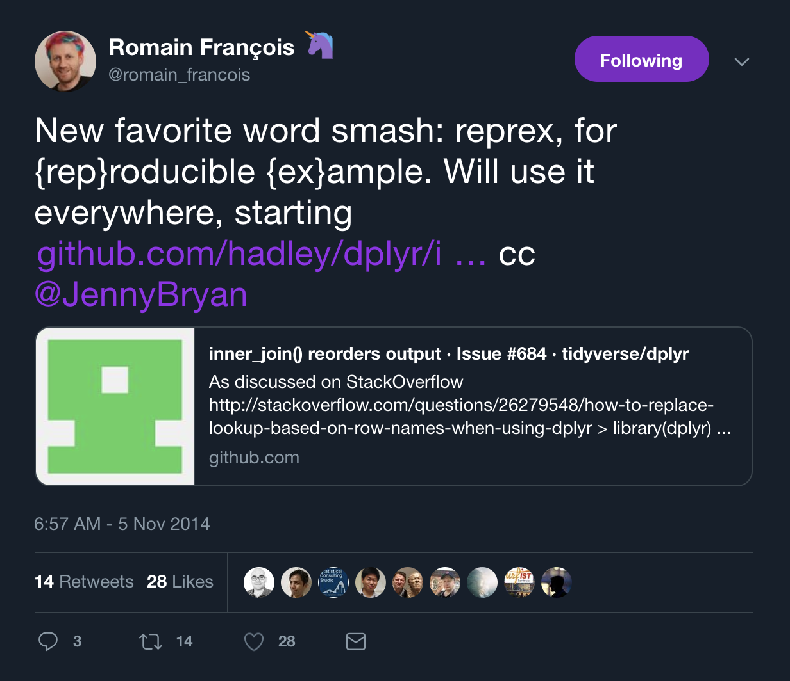

```{r setup, include=FALSE}
options(htmltools.dir.version = FALSE)
```

# About me

- Cancer Prevention Fellow 
  - at National Cancer Institute
- Co-Chair, Bioinformatics & Data Science
  - at Foundation for Advanced Education in the Sciences
- Twitter: [@marskar](https://twitter.com/marskar)
- Website: https://marskar.github.io
- Slides: https://marskar.github.io/satrday/slides

.center[</img>]

---

# Talk inspired by personal experiences

True story: helping a friend debug a Keras model in a Jupyter notebook

.center[</img>]


---
# I want to help you...

but you're not making it easy.

Unleash the Jerry Maguire GIF! (Popularized by Jennifer Bryan)
- [RStudio webinar](https://resources.rstudio.com/webinars/help-me-help-you-creating-reproducible-examples-jenny-bryan)
-  [rOpenSci Community Call 2017](https://speakerdeck.com/jennybc/reprex-help-me-help-you)
- [reprex package docs](https://reprex.tidyverse.org/)

 


---
# What is a reprex?

[](https://twitter.com/romain_francois/status/530011023743655936)


---
# What is a portmanteau?

Though Hadley prefers to call it a portmanteau.

[](https://twitter.com/hadleywickham/status/530168226684993537)

---


.center[<a href="https://twitter.com/DynamicWebPaige/status/1071072962634280960"></img></a>]

---
# The 9 Rs of Really Rocking R projects

<a href="https://commons.wikimedia.org/wiki/File:R_logo.svg#/media/File:R_logo.svg"></a>

1. Reprexes - in documentation, not just for solving problems!
--

2. R - don't use excel or proprietary tools
--

3. Reproducibility - use Rmarkdown/knitr/spin, packrat, pkgdown
--

4. Reliability - write tests with testthat
--

5. Research - don't Reinvent the wheel, know the ecosystem
--

6. Rigor - follow best practices and don't take shortcuts
--

7. Reusability - don't copy/paste, use functions, source scripts, load packages
--

8. Relax - work smarter, not harder, and automate Repetition tasks
--

9. Relay - information in your documentation
--

---
# Minimal packages

.center[<a href="https://twitter.com/WeAreRLadies/status/1067861737137823744"></img></a>]
by [Charlotte Wickham aka CVWickham](https://twitter.com/CVWickham)

---
# Write a package from scratch
by [Hilary Parker aka hspter](https://twitter.com/hspter)

.center[<a href="https://hilaryparker.com/2014/04/29/writing-an-r-package-from-scratch/"></img></a>]

---
# Tools 1: `usethis`

.center[<a href="https://usethis.r-lib.org/"></img></a>]

---
# Tools 2: `testthat`

.center[<a href="https://github.com/r-lib/testthat#testthat-"></img></a>]

---
# Tools 3: `roxygen2` & `devtools`

.center[<a href="https://rawgit.com/rstudio/cheatsheets/master/package-development.pdf"></img></a>]

---
# How to follow-along 1: [Binder](https://mybinder.org/)

.center[<a href="https://mybinder.org/"></img></a>]

---
# How to follow-along 2: [RStudio Binder](https://github.com/binder-examples/r_with_python#r--python-binder-example)

.center[<a href="https://github.com/marskar/rstudio#introduction-to-rstudio"></img></a>]


---
# How to follow-along 3: [RStudio Cloud](https://rstudio.cloud/)

.center[<a href="https://rstudio.cloud/"></img></a>]

---
# How to follow-along 4: [GitHub](https://github.com/)

.center[<a href="https://github.com/"></img></a>]

---
# Minimal package demo

.center[<a href="https://github.com/marskar/respect"></img></a>]

---
# Minimal package [gist](https://gist.github.com/marskar/ce0e2277733313afb1cc8ccfccab2bb2) 1: [Line 1](https://gist.github.com/marskar/ce0e2277733313afb1cc8ccfccab2bb2#file-setup-r-L1)

```r
#' ---
#' title: "How to set up a project - R script"
#' author: "Martin Skarzynki"
#' date: "`r Sys.Date()`"
#' output:
#'  html_document:
#'    keep_md: true
#' ---
#'
#' # Step 1: Create a package/project
#'
#' ### Install `usethis` if not already installed
if (!require(usethis)) install.packages('usethis')
#'
#' ### Create a new package called `respect`
#'
usethis::create_package('respect')
#'
#' New project will open, copy this script there
```

---
# Minimal package [gist](https://gist.github.com/marskar/ce0e2277733313afb1cc8ccfccab2bb2) 2: [Line 21](https://gist.github.com/marskar/ce0e2277733313afb1cc8ccfccab2bb2#file-setup-r-L21)

```r
#' # Step 2: Set up version control and GitHub
#'
#' ### Set up git
usethis::use_git()
#'
#' Git pane in RStudio is available after a restart
#'
#' Pull and Push are unavailable for now
#'
#' ### Set up git user.name and user.email
#'
usethis::use_git_config(user.name = "Martin Skarzynski", user.email = "myemail@example.com")
usethis::use_git_config()
#' ### Get a GitHub Personal Access Token (PAT)
usethis::browse_github_pat()
#' ### Add the PAT to .Renviron,
#'
#' e.g. GITHUB_PAT=8c70fd8419398999c9ac5bacf3192882193cadf2
#'
usethis::edit_r_environ()
```

---
# Minimal package [gist](https://gist.github.com/marskar/ce0e2277733313afb1cc8ccfccab2bb2) 3: [Line 46](https://gist.github.com/marskar/ce0e2277733313afb1cc8ccfccab2bb2#file-setup-r-L46)

```r
#' ### View DESCRIPTION defaults
usethis::use_description_defaults()
#' ### Edit DESCRIPTION title, name, and description
usethis::use_description(
  fields = list(Title = "Code and Docs that Respect People",
                `Authors@R` = 'person("Martin", "Skarzynski", email = "myemail@example.com", role = c("aut", "cre"))',
                Description = 'This R Package demonstrates examples of best practices. It can save time and make life easier for you, future you, and others.',
                Suggests = 'usethis, testthat, knitr, rmarkdown, devtools'
))
#' ### Add a license, e.g. MIT
usethis::use_mit_license(name = 'Martin Skarzynski')
#' ### Connect to github
usethis::use_github(protocol = 'https')
#' Check github to see your DESCRIPTION there
#'
#' ### Add a readme
usethis::use_readme_md()
```

---
# Minimal package [gist](https://gist.github.com/marskar/ce0e2277733313afb1cc8ccfccab2bb2) 4: [Line 76](https://gist.github.com/marskar/ce0e2277733313afb1cc8ccfccab2bb2#file-setup-r-L76)

```r
#' # Step 3: write r code or move exist scripts to r folder
#'
#' ### create an r script in the r/ folder
usethis::use_r('respect')
#'
#' ### use rstudio shortcut to add roxygen skeleton
#' - windows/linux: ctrl+shift+alt+r
#' - mac: cmd+shift+alt+r
#' - [all shortcuts](https://support.rstudio.com/hc/en-us/articles/200711853-keyboard-shortcuts)
#' fill in @param, @return, and add at least one example under @examples
#'
#' # Step 4: document functions with roxygen2 or devtools
#'
#' ### install `devtools` if not already installed
if (!require(devtools)) install.packages('devtools')
#' ### update namespace and create a `man` directory with an `.rd` file for each function
devtools::document()
```

---
# Minimal package [gist](https://gist.github.com/marskar/ce0e2277733313afb1cc8ccfccab2bb2) 5: [Line 94](https://gist.github.com/marskar/ce0e2277733313afb1cc8ccfccab2bb2#file-setup-r-L94)

```r
#' # Step 5: Create unit tests to make sure your code works
#' ### Install `testhat` if not already installed
if (!require(testthat)) install.packages('testthat')
#' ### Create `testhat` infrastructure
usethis::use_testthat()
#' ### Create a `testhat` unit test
usethis::use_test('respect')
#' ### Run the test suite (ok, it's just one test)
devtools::test()
#'
#' # Step 6: Check if package is ready to share
devtools::check()
```

---
# Minimal package [gist](https://gist.github.com/marskar/ce0e2277733313afb1cc8ccfccab2bb2) 6: [Line 106](https://gist.github.com/marskar/ce0e2277733313afb1cc8ccfccab2bb2#file-setup-r-L106)


If your packages passes the check,
just commit and push to github. 

Finally, install and test your package.

```r
#' ### Test that the package is installable
devtools::install_github('marskar/respect')
library(respect)
#' ### Test that the package works as expected
respect::respect('you')
```

--
Congratulations! You did it!

---

background-image: url("pkg_dev.png")
background-position: center
background-size: contain

#  usethis, testthat, roxygen2 & devtools!


---
# Thanks for listening!


Let's 
- show that we care
- leverage the tools awesome people have made
- work and learn out in the open together!

Happy to take questions afterwards! Or just tweet at me!
[](https://twitter.com/marskar)
